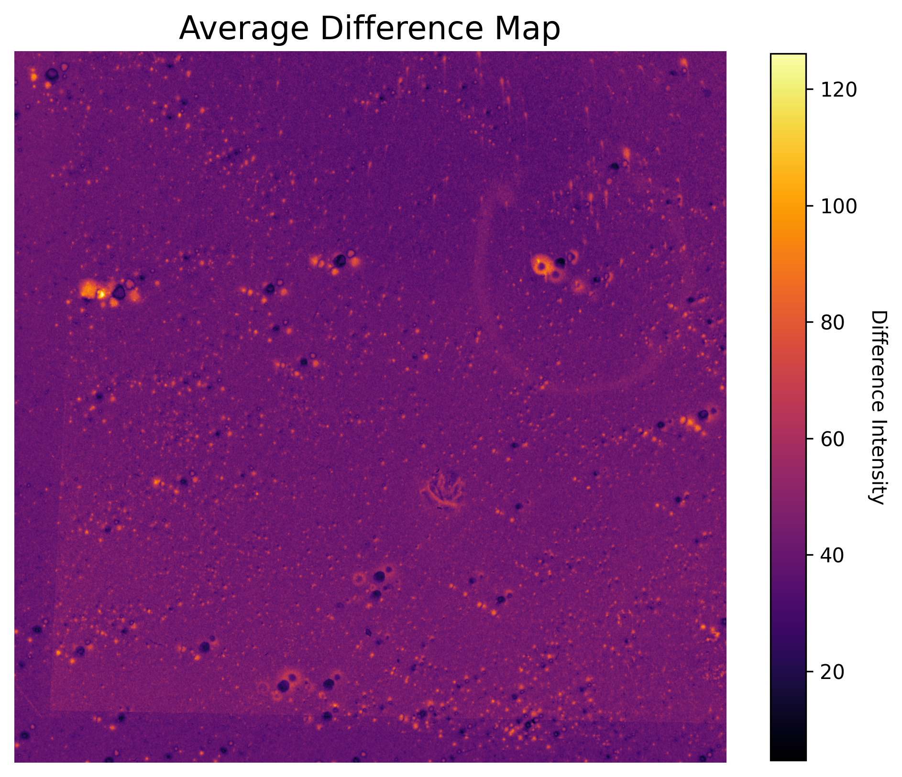

# Lost Stars Project

The goal of this project was to determine and implement a possible solution to analysing the abnormal phenomenon named 'lost stars' in images of fields in the sky. The task was assigned as part of the [Space Engineering course](https://intranet.fel.cvut.cz/en/education/bk/predmety/47/49/p4749406.html) at [FEE CTU](https://fel.cvut.cz/en) in Prague. It was done in collaboration with [Sonneberg Observatory](https://www.astronomiemuseum.de/), Germany. This repository contains the full code, which is complemented by a PDF report.

## Workflow
Our program works on the following basis. We were given two sets of images of fields in the sky. One set is older (first third of 20th century) and the second set is more recent (late 20th century). We denote the relation between those sets, i.e. pair correspondence in a specific file, see `config.yaml` for an example configuration. 

Once the pairs are set correctly, we divide the original images into smaller tiles. The tile pairs are then analysed and a transformation is found between the past tile and the recent tile, to ensure there are no misalignments at play. 

Once that is done, the absolute difference in pixel value is calculated and a so-called difference map is created. This map showcases the possible spots for a lost star candidate. The brighter a spot in the difference map is, the higher the chance. 

Finally, we average out the difference maps for all tiles, to minimase possible miscalculations or anomalies.

## Setup

There are currently three python files. In `main.py`, the main logic is implemented. The image handling, calculations and operations are handled through `image_engine.py`. Last but not least, `utils.py` implements some minor functions.


The program runs by launching `main.py` where the user is expected to provide the following arguments:
```
1. -p %path | for specifying the path to past images. Mandatory.
2. -r %path | for specifying the path to recent images. Mandatory.
3. -d       | for debug mode. Displays additional information. Optional.
```
The program can be run from the command line directly (provided the correct arguments) or by using a bash script, i.e. `./run.sh` for regular version and `./run_debug.sh` for the debug version. It is recommended to use this, however mind, that it is neccessary to adjust the path to the image sets within those files if you wish to use this way.


## Example Results
Below are some of the examples of results achieved.




